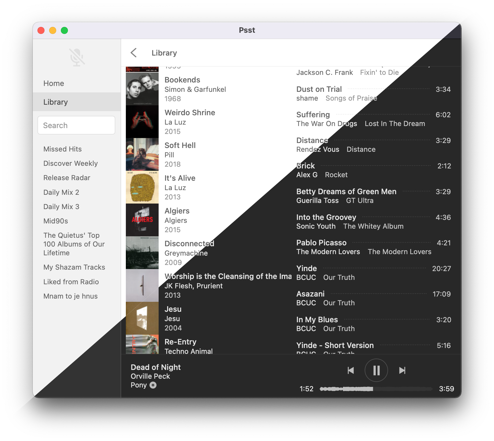

# Xpotify + Splitify

[Descargar Xpotify para Windows x64](https://github.com/angelopol/xpotify/releases/latest) · [Uso y configuración](SPLITIFY.md) · [Estado de funciones](ROADMAP.md)

Cliente nativo basado en Psst, con organización de playlists mediante Gemini, letras sincronizadas, cola interactiva y controles de reproducción en la vista previa de la barra de tareas de Windows. La versión 0.3.0 incorpora un receptor Spotify Connect nativo para controlar la PC desde otros dispositivos, conservando caché, carga bajo demanda y reutilización de playlists por `snapshot_id`. El motor nativo no reporta escuchas al historial de Spotify; esta limitación se mantiene por elección del usuario.

## Integración local con Splitify

En **0.4.4**, la cola muestra páginas de 50 canciones, con botones para avanzar y volver tanto en el panel del reproductor como en la vista completa. Cambiar de página no consulta la API de Spotify.

En **0.4.3**, la sombra llega hasta el volumen y la línea de progreso mide 2 píxeles, conservando un área de clic cómoda.

En **0.4.2**, el reproductor incorpora una sombra de bloques verdes que responde al audio local y se desvanece al pausar.

En **0.4.1** se amplía el margen del scroll, Letras/Cola/Videoclip comparten una fila y las playlists tienen un botón de reproducción visible al desplazarse. El enlace Source de la aplicación apunta a este repositorio.

La versión **0.4.0** adapta mejoras de Spotifast: cola del motor con orden aleatorio real, filas virtualizadas para listas largas, colores y separadores compactos, consultas HTTP acotadas y caché por petición. Consulta [qué se incorporó y sus límites](SPOTIFAST-INTEGRATION.md).

Esta versión añade un editor nativo de playlists con `gemini-3.5-flash-lite`. Pulsa **Organizar con IA** o haz clic derecho en una playlist y elige **Dividir con Splitify IA**. Configura `GEMINI_API_KEY` y `SPOTIFY_CLIENT_ID` en `.env.local`; añade `http://127.0.0.1:8888/login` como redirect URI en Spotify Developer Dashboard. La autorización de reproducción nativa utiliza por separado `http://127.0.0.1:8898/login`. La IA propone una vista previa editable y el botón de creación genera playlists privadas. La reproducción sigue usando el cliente nativo.

Consulta [la revisión de seguridad](SECURITY-REVIEW.md): se corrigieron fugas de tokens en el código heredado y se actualizaron dependencias. La rama `main` del repositorio Splitify conserva la aplicación web; la integración nativa vive en este repositorio xpotify, rama `splitify-integration`. Ejecuta `Start-Xpotify.cmd`; consulta [uso y configuración](SPLITIFY.md).

A fast Spotify client with a native GUI written in Rust, without Electron.
Psst is still very early in development, lacking in features, stability, and general user experience.
It's fully cross-platform, supporting Windows, Linux, and macOS.
Contributions are welcome!

**Note:** A Spotify Premium account is required.

> **ℹ️ As of February 2026, Spotify [changed developer access](https://developer.spotify.com/blog/2026-02-06-update-on-developer-access-and-platform-security), and Psst now requires your own Spotify Developer Client ID for Web API features (search, library, playlists).** Register an app at the [Spotify Developer Dashboard](https://developer.spotify.com/dashboard) (redirect URI: `http://127.0.0.1:8888/login` and enable Web API), then enter its Client ID on Psst's sign-in screen.

[](https://github.com/jpochyla/psst/actions)



## Download

GitHub Actions automatically builds and releases new versions when changes are pushed to the `main` branch.
You can download the latest release for Windows, Linux, and macOS from the [GitHub Releases page](https://github.com/jpochyla/psst/releases/latest).

| Platform               | Download Link                                                                            |
| ---------------------- | ---------------------------------------------------------------------------------------- |
| Linux (x86_64)         | [Download](https://github.com/jpochyla/psst/releases/latest/download/psst-linux-x86_64)  |
| Linux (aarch64)        | [Download](https://github.com/jpochyla/psst/releases/latest/download/psst-linux-aarch64) |
| Debian Package (amd64) | [Download](https://github.com/jpochyla/psst/releases/latest/download/psst-amd64.deb)     |
| Debian Package (arm64) | [Download](https://github.com/jpochyla/psst/releases/latest/download/psst-arm64.deb)     |
| macOS                  | [Download](https://github.com/jpochyla/psst/releases/latest/download/Psst.dmg)           |
| Windows                | [Download](https://github.com/jpochyla/psst/releases/latest/download/Psst.exe)           |

Unofficial builds of Psst are also available through the [AUR](https://aur.archlinux.org/packages/psst-git) and [Homebrew](https://formulae.brew.sh/cask/psst).

## Building

On all platforms, the **latest [Rust](https://rustup.rs/) stable** (at least 1.89.0 for the current lockfile) is required.
For platform-specific requirements, see the dropdowns below.

<details>
<summary>Linux</summary>

Our user-interface library, Druid, has two possible backends on Linux: GTK and pure X11, with a Wayland backend in the works.
The default Linux backend is GTK.
Before building on Linux, make sure the required dependencies are installed.

### Debian/Ubuntu

```shell
sudo apt-get install libssl-dev libgtk-3-dev libcairo2-dev libasound2-dev
```

### RHEL/Fedora

```shell
sudo dnf install openssl-devel gtk3-devel cairo-devel alsa-lib-devel
```

</details>

<details>
<summary>OpenBSD (WIP)</summary>

OpenBSD support is still a WIP, and things will likely not function as intended.
Similar to Linux, Druid defaults to GTK while also providing a pure X11 backend.
Furthermore, bindgen must be able to find LLVM through the expected environment variable.
Only OpenBSD/amd64 has been tested so far.

```shell
doas pkg_add gtk+3 cairo llvm
export LIBCLANG_PATH=/usr/local/lib
```

In case rustc(1) fails building bigger crates

```shell
memory allocation of xxxx bytes failed
error: could not compile `gtk`
Caused by:
  process didn't exit successfully: `rustc --crate-name gtk [...]` (signal: 6, SIGABRT: process abort signal)
warning: build failed, waiting for other jobs to finish...
```

try increasing your user's maximum heap size:

```shell
ulimit -d $(( 2 * `ulimit -d` ))
```

</details>

---

#### Build from Source

```shell
cargo build
# Append `--release` for a release build.
```

#### Run from Source

```shell
cargo run --bin psst-gui
# Append `--release` for a release build.
```

#### Build Installation Bundle (i.e., macOS .app)

```shell
cargo install cargo-bundle
cargo bundle --release
```

## Roadmap

Native fork status: see [ROADMAP.md](ROADMAP.md) for implementation details, validation and platform/API limits. Windows is the tested platform. Playlist folders are local; Spotify's public API does not expose its folders. Native listen reporting remains pending.

- [x] Vorbis track playback
- [x] Browsing saved albums and tracks
- [x] Save / unsave albums and tracks
- [x] Browsing followed playlists
- [x] Search for artists, albums, and tracks
- [x] Podcast support
- [x] Media keys control
- [x] Open Spotify links through the search bar
- [x] Audio volume control
- [x] Audio loudness normalization
- [x] Genre playlists and "For You" content
- [x] Dark theme
- [x] Credits support
- [x] Resilience to network errors (bounded retries for read requests)
- [x] Managing playlists
  - Follow/unfollow
  - Add/remove tracks
  - Reorder tracks
  - Rename playlist
  - Local playlist folders (not synchronized with Spotify folders)
- [x] Playback queue
- [x] React to default audio output device events (CPAL; physical headphone checks pending)
  - Pause after disconnecting headphones
  - Transfer playback after connecting headphones
- [x] Better caching
  - Cache as many WebAPI responses as possible
  - Visualize cache utilization
    - Total cache usage in the config dialog
    - Show time origin of cached data, allow to refresh
- [x] Artist biography/statistics and Wikipedia links
- [x] Downloading encrypted tracks into the playback cache
- [ ] Reporting played tracks to Spotify servers
- [ ] OS-specific application bundles (Windows ZIP tested; macOS/Linux packaging scripts await platform validation)
- UI
  - [x] Rethink the current design, consider a two-pane layout
    - Left pane for browsing
    - Right pane for current playback
  - [x] Detect light/dark OS theme (Windows; other platforms need validation)
  - [x] Robust error states, with a retry button
  - [x] Correct playback highlight
    - Highlight now-playing track only in the correct album/playlist
    - Keep highlighted track in viewport
  - [x] Paging for albums, tracks and queue entries
  - [x] Grid for albums and artists
  - [x] Robust active/inactive navigation and disabled controls
  - [x] Save playback state, including shuffle order and manual queue additions

## Development

Contributions are very welcome!  
Here's the basic project structure:

- `/psst-core` - Core library, takes care of Spotify TCP session, audio file retrieval, decoding, audio output, playback queue, etc.
- `/psst-gui` - GUI application built with [Druid](https://github.com/linebender/druid)
- `/psst-cli` - Example CLI that plays a track. Credentials must be configured in the code.

## Privacy Policy

Spotify credentials are sent only to the official Spotify API hosts. Cover images are fetched without credentials from approved HTTPS CDNs. The optional Last.fm feature connects to Last.fm; Splitify sends compact song metadata to Google Gemini only when generating a preview. No Spotify tokens are sent to Gemini. See SECURITY-REVIEW.md for the corrected inherited token leaks and remaining limitations.
Caches of various things are stored locally and can be deleted anytime.
User credentials are not stored at all; instead, a re-usable authentication token from Spotify is used.

## Thanks

This project would not exist without the following:

- Big thank you to [`librespot`](https://github.com/librespot-org/librespot), the Open Source Spotify client library for Rust. Most of `psst-core` is directly inspired by the ideas and code of `librespot`, although with a few differences:
  - This fork integrates native Spotify Connect using librespot 0.8.0 and the native audio output. The original engine remains available with Connect disabled. Native listen reporting is not implemented.
  - Psst is completely synchronous, without `tokio` or other `async` runtime, although it will probably change in the future.
  - Psst is using HTTPS-based CDN audio file retrieval, similar to the official Web client or [`librespot-java`](https://github.com/librespot-org/librespot-java), instead of the channel-based approach in `librespot`.
- [`druid`](https://github.com/linebender/druid) native GUI library for Rust.
- [`ncspot`](https://github.com/hrkfdn/ncspot) cross-platform ncurses Spotify client written in Rust, using `librespot`.
- ...and of course other libraries and projects.
