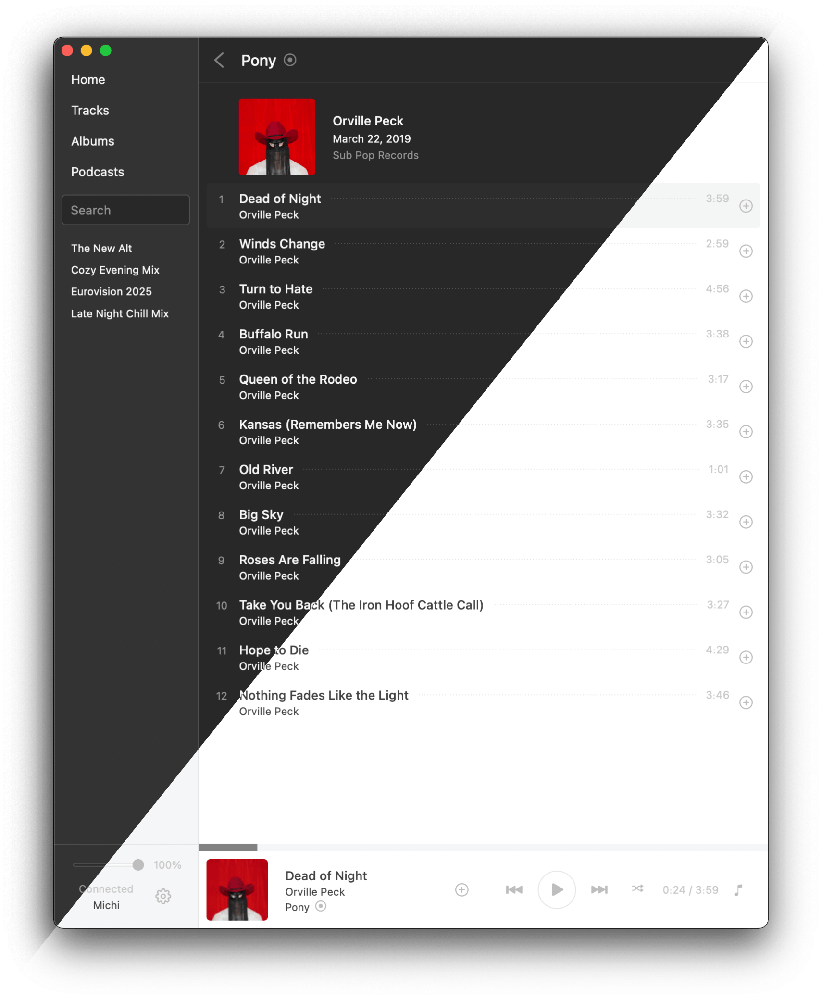

# Psst

A fast Spotify client with a native GUI written in Rust, without Electron.
Psst is still very early in development, lacking in features, stability, and general user experience.
It's fully cross-platform, supporting Windows, Linux, and macOS.
Contributions are welcome!

**Note:** A Spotify Premium account is required.

[](https://github.com/jpochyla/psst/actions)



## Download

GitHub Actions automatically builds and releases new versions when changes are pushed to the `main` branch.
You can download the latest release for Windows, Linux, and macOS from the [GitHub Releases page](https://github.com/jpochyla/psst/releases/latest).

| Platform               | Download Link                                                                            |
| ---------------------- | ---------------------------------------------------------------------------------------- |
| Linux (x86_64)         | [Download](https://github.com/jpochyla/psst/releases/latest/download/psst-linux-x86_64)  |
| Linux (aarch64)        | [Download](https://github.com/jpochyla/psst/releases/latest/download/psst-linux-aarch64) |
| Debian Package (amd64) | [Download](https://github.com/jpochyla/psst/releases/latest/download/psst-amd64.deb)     |
| Debian Package (arm64) | [Download](https://github.com/jpochyla/psst/releases/latest/download/psst-arm64.deb)     |
| macOS                  | [Download](https://github.com/jpochyla/psst/releases/latest/download/Psst.dmg)           |
| Windows                | [Download](https://github.com/jpochyla/psst/releases/latest/download/Psst.exe)           |

Unofficial builds of Psst are also available through the [AUR](https://aur.archlinux.org/packages/psst-git) and [Homebrew](https://formulae.brew.sh/cask/psst).

## Building

On all platforms, the **latest [Rust](https://rustup.rs/) stable** (at least 1.65.0) is required.
For platform-specific requirements, see the dropdowns below.

<details>
<summary>Linux</summary>

Our user-interface library, Druid, has two possible backends on Linux: GTK and pure X11, with a Wayland backend in the works.
The default Linux backend is GTK.
Before building on Linux, make sure the required dependencies are installed.

### Debian/Ubuntu

```shell
sudo apt-get install libssl-dev libgtk-3-dev libcairo2-dev libasound2-dev
```

### RHEL/Fedora

```shell
sudo dnf install openssl-devel gtk3-devel cairo-devel alsa-lib-devel
```

</details>

<details>
<summary>OpenBSD (WIP)</summary>

OpenBSD support is still a WIP, and things will likely not function as intended.
Similar to Linux, Druid defaults to GTK while also providing a pure X11 backend.
Furthermore, bindgen must be able to find LLVM through the expected environment variable.
Only OpenBSD/amd64 has been tested so far.

```shell
doas pkg_add gtk+3 cairo llvm
export LIBCLANG_PATH=/usr/local/lib
```

In case rustc(1) fails building bigger crates

```shell
memory allocation of xxxx bytes failed
error: could not compile `gtk`
Caused by:
  process didn't exit successfully: `rustc --crate-name gtk [...]` (signal: 6, SIGABRT: process abort signal)
warning: build failed, waiting for other jobs to finish...
```

try increasing your user's maximum heap size:

```shell
ulimit -d $(( 2 * `ulimit -d` ))
```

</details>

---

#### Build from Source

```shell
cargo build
# Append `--release` for a release build.
```

#### Run from Source

```shell
cargo run --bin psst-gui
# Append `--release` for a release build.
```

#### Build Installation Bundle (i.e., macOS .app)

```shell
cargo install cargo-bundle
cargo bundle --release
```

## Roadmap

- [x] Vorbis track playback
- [x] Browsing saved albums and tracks
- [x] Save / unsave albums and tracks
- [x] Browsing followed playlists
- [x] Search for artists, albums, and tracks
- [x] Podcast support
- [x] Media keys control
- [x] Open Spotify links through the search bar
- [x] Audio volume control
- [x] Audio loudness normalization
- [x] Genre playlists and "For You" content
- [x] Dark theme
- [x] Credits support
- [ ] Resilience to network errors (automatically retry timed-out requests)
- [ ] Managing playlists
  - Follow/unfollow
  - Add/remove tracks
  - Reorder tracks
  - Rename playlist
  - Playlist folders
- [x] Playback queue
- [ ] React to audio output device events
  - Pause after disconnecting headphones
  - Transfer playback after connecting headphones
- [ ] Better caching
  - Cache as many WebAPI responses as possible
  - Visualize cache utilization
    - Total cache usage in the config dialog
    - Show time origin of cached data, allow to refresh
- [ ] Trivia on the artist page, Wikipedia links
- [ ] Downloading encrypted tracks
- [ ] Reporting played tracks to Spotify servers
- [ ] OS-specific application bundles
- UI
  - [ ] Rethink the current design, consider a two-pane layout
    - Left pane for browsing
    - Right pane for current playback
  - [ ] Detect light/dark OS theme
  - [ ] Robust error states, ideally with a retry button
  - [ ] Correct playback highlight
    - Highlight now-playing track only in the correct album/playlist
    - Keep highlighted track in viewport
  - [ ] Paging or virtualized lists for albums and tracks
  - [ ] Grid for albums and artists
  - [ ] Robust active/inactive menu visualization
  - [ ] Save playback state

## Development

Contributions are very welcome!  
Here's the basic project structure:

- `/psst-core` - Core library, takes care of Spotify TCP session, audio file retrieval, decoding, audio output, playback queue, etc.
- `/psst-gui` - GUI application built with [Druid](https://github.com/linebender/druid)
- `/psst-cli` - Example CLI that plays a track. Credentials must be configured in the code.
- `/psst-protocol` - Internal Protobuf definitions used for Spotify communication.

## Privacy Policy

Psst connects only to the official Spotify servers and does not call home.
Caches of various things are stored locally and can be deleted anytime.
User credentials are not stored at all; instead, a re-usable authentication token from Spotify is used.

## Thanks

This project would not exist without the following:

- Big thank you to [`librespot`](https://github.com/librespot-org/librespot), the Open Source Spotify client library for Rust. Most of `psst-core` is directly inspired by the ideas and code of `librespot`, although with a few differences:
  - Spotify Connect (remote control) is not supported yet.
  - Psst is completely synchronous, without `tokio` or other `async` runtime, although it will probably change in the future.
  - Psst is using HTTPS-based CDN audio file retrieval, similar to the official Web client or [`librespot-java`](https://github.com/librespot-org/librespot-java), instead of the channel-based approach in `librespot`.
- [`druid`](https://github.com/linebender/druid) native GUI library for Rust.
- [`ncspot`](https://github.com/hrkfdn/ncspot) cross-platform ncurses Spotify client written in Rust, using `librespot`.
- ...and of course other libraries and projects.
